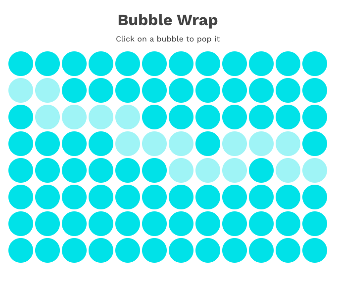

# Bubble Wrap

Take a break, release some stress by popping some virtual [bubble wrap](http://shannoncrabill.com/bubble-wrap).

[Built with React](https://shannoncrabill.com/blog/bubble-wrap/) and deployed with Netlify as part of [#7Days7Websites](https://shannoncrabill.com/blog/7-days-7-websites/).

## Installation

Bubble wrap is hosted with Netlify and can be played here:

> [Bubble Wrap](https://shannoncrabill.com/bubble-wrap)

Bubble wrap can also be downloaded and played locally

- Run `git clone https://github.com/scrabill/bubble-wrap`
- `cd bubble-wrap`
- `npm install`
- `npm start`
- If it does not open automatically in your browser, navigate to `http://localhost:3000/` to play

## Improvements

- Offset alternating rows of bubbles
- Sounds effects?!
- Variations of colors for each bubble
